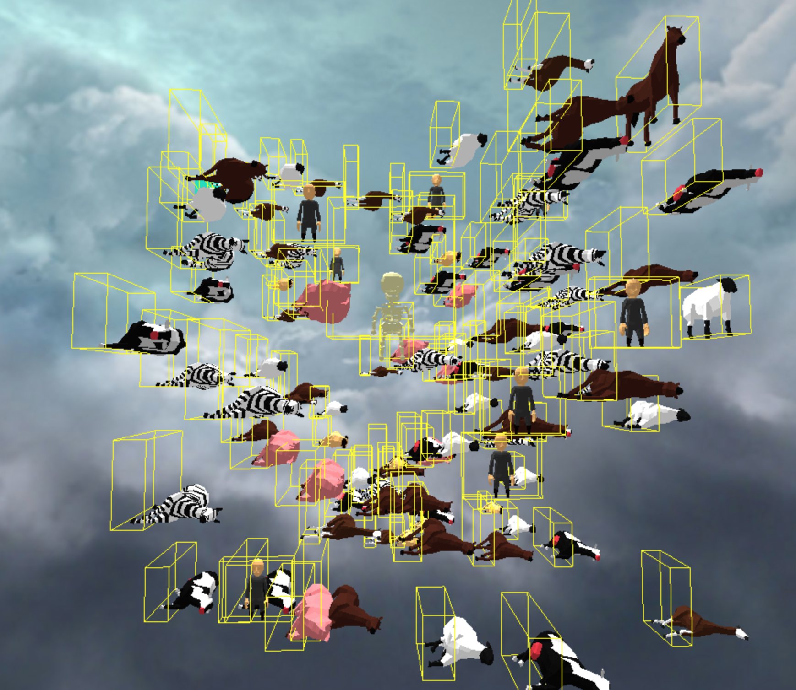

# Farmyard Fight Club
### A Three.js 3D Coronavirus Codealong

___


#### INSTRUCTIONS


```bash
# Clone this repo to somewhere familiar:
cd ~
git clone https://github.com/textchimp/farmyard-fight-club.git

# Go there:
cd farmyard-fight-club

# Open editor
atom .

# Recommended: install 'reload' package
npm install -g reload

# Start reload server
reload

# (NOTHING TO SEE YET)
# (AWAIT FURTHER INSTRUCTIONS)

# Why not download some Zoom virtual background videos while you wait:
# https://pixabay.com/videos/search/abstract/
```





## GOALS

- Make a fun game and have fun
- Learn about stuff like 3D graphics and game logic and maths and stuff
- Practice coding
- Catchup... so lonely

## Plan

- Make a 3D scene using three.js
- Create some objects: cube, land, backgrounds
- Load some 3D models
- Animate the models, switch between animations
- Animation render loop
- Controls: move character using keyboard
- Camera POV changes: from world to player

## Dreams / Wishlist

- Camera POV switching: world to player
- Collision detection!
- Sounds! Footsteps etc, dying sounds
- More actual game logic - how do you play the game?
Do you just knock over other animals?
Can you shoot them with laser beams from your eyes?
Can you push each other off the edge of a platform? Chase each other around?
- Better management of character/game state, and animation cueing
- Augmented Reality / outdoor GPS-based playing?
- More models!
- Landscape! Mountains, water, forests, bits of grass, clouds etc?
- Mobile-friendly controls? (on-screen buttons, gyro/tilt control?)
- Decent game AI?????
- Higher-res skybox images
- Huge explosions
- Networked multiplayer mode - Firebase?


## Session 2
- Switch camera POVs; limit camera angle (don't go below land)
- refactor Character setup, subclass Player from Character
- Game interaction stuff: collision detection;
  raycasting ('what am i looking at?') - shooting lasers and seeing what you hit
- sound effects; walking sound, dying sounds? positional sounds??
- clean up changeState / changeAnimation code, to make it easier to
  modify the animation params - i.e. walking backwards

## Review

- Load up scripts
- main.js:
   - app.init():
     - create 3D scene
     - load models and create characters: app.initCharacters()
           - in modelmanager onLoad():
                - add characters
                - app.animate()  ---- MAIN GAME RENDER/UPDATE
                    - for each character, call their update() method
                         - updating the animation
     - load scenery models: app.initScenery()
     - load keyboard handlers: app.initKeys()


#### CREDITS

3D Character Models: https://opengameart.org/users/quaternius

3D Scenery Models: https://www.cgtrader.com/free-3d-models/plant/other/low-poly-trees-d9e99730-93d6-4564-a477-7ec52a990a3c

Grass texture: https://github.com/mxro/threejs-test/tree/master/test4/public/textures

Inspiring tutorial: https://threejsfundamentals.org/threejs/lessons/threejs-game.html

Backgrounds & skyboxes: https://threejsfundamentals.org/threejs/lessons/threejs-backgrounds.html
